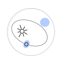

# Kepler

Kepler provides an architecture to organize your software as a set of
loosely-coupled systems, where each can be easily accessed and has a
well-defined responsibility.

> *Name origin*: Mathematician and astronomer [Johannes Kepler](https://en.wikipedia.org/wiki/Johannes_Kepler) is best known for his laws of planetary motion that describes how planets move around the Sun.

## Quick links

- [**Explore the docs**](docs/README.md)
- [Report a defect](https://github.com/ba-st/Kepler/issues/new?labels=Type%3A+Defect)
- [Request a feature](https://github.com/ba-st/Kepler/issues/new?labels=Type%3A+Feature)

## License

- The code is licensed under [MIT](LICENSE).
- The documentation is licensed under [CC BY-SA 4.0](http://creativecommons.org/licenses/by-sa/4.0/).

## Installation

To load the project in a Pharo image follow this [instructions](docs/how-to/how-to-load-in-pharo.md).

## Contributing

Check the [Contribution Guidelines](CONTRIBUTING.md)
